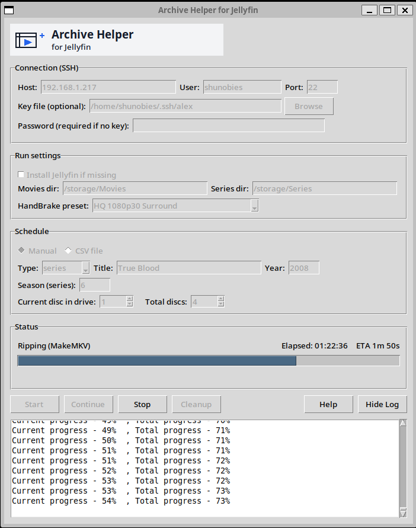

# Archive Helper GUI for Jellyfin

**Archive Helper GUI for Jellyfin** is a Python desktop app that helps you rip and encode your DVDs and Blu-rays for use with a Jellyfin media server. It gives you a friendly GUI to control a rip server over SSH and run a workflow that uses MakeMKV and HandBrake to prepare your media in a format Jellyfin can organize and play.

---

## 🔧 What This Project Does

This tool makes it easier to:

- Connect to a remote rip server using SSH
- Upload media ripping schedules
- Upload and update the ripping & encoding workflow script
- Remotely run the ripping and encoding process
- See progress and get prompts when it’s time to insert the next disc

The rip server runs the heavy lifting with tools like **MakeMKV** and **HandBrakeCLI**, while this app provides a simple interface to control it from your desktop.

---

## 🚀 Features

- Remote control via SSH to run rip/encode workflows
- Manual and CSV schedule support for movies and TV series
- HandBrake presets selection
- Real-time progress updates
- Prompts to swap discs
- Keeps settings between runs
- Designed for ease of use on Linux servers

---

## 📌 What You Need

Before using this app, make sure your rip server has:

- **Python 3**
- **MakeMKV** (for ripping discs)
- **HandBrakeCLI** (for encoding to MP4/MKV in Jellyfin-friendly formats)
- SSH access from your workstation

You should also have a working Jellyfin server and libraries configured (for example: `/storage/Movies` and `/storage/Series`).  
Jellyfin is a free, open-source media system for organizing and streaming media to clients on TVs, phones, tablets, and more.:contentReference[oaicite:0]{index=0}

---

## 🛠 How It Works

1. **SSH Connect**  
   The app connects to your rip server using SSH, so you don’t have to open a terminal.

2. **Scheduling**  
   You can either:
   - Enter one title manually (movie or TV season)
   - Load a CSV schedule with multiple entries

3. **Ripping & Encoding**  
   On the server, the script will:
   - Rip your disc using MakeMKV
   - Encode the rip with HandBrakeCLI using your selected preset
   - Prompt you when it’s time to insert the next disc

4. **Output**  
   Completed media is stored in your configured Movies/Series directories on the server in a format Jellyfin can readily scan and organize.

---

## 📁 Interface Overview

### Connection (SSH)

| Field | Description |
|-------|-------------|
| **Host** | IP or hostname of the rip server |
| **User** | Linux username on the rip server |
| **Port** | SSH port (default is usually `22`) |
| **Key file (optional)** | SSH private key to login without a password |
| **Password** | Used if you’re not using a key |

---

### Run Settings

| Option | What It Does |
|--------|-------------|
| **Install Jellyfin if missing** | Installs/starts Jellyfin on the server (requires sudo access) |
| **Movies dir** | Where movie files will go on the server |
| **Series dir** | Where TV show files will go |
| **HandBrake preset** | Preset for encoding quality |

---

### Schedule

This tells the server what to rip.

#### Manual

- **Type:** movie or series
- **Title:** name of the media
- **Year:** used for naming / Jellyfin metadata
- **Season:** for series only
- **Disc count:** how many discs in the job

#### CSV file

- Load a pre-prepared CSV with multiple titles and disc counts

---

### Control Buttons

| Button | What It Does |
|--------|--------------|
| **Start** | Starts a scheduled rip/encode |
| **Continue** | After inserting the next disc in a multi-disc job |
| **Stop** | Cancels the current job |
| **Show Log** | Shows server output for troubleshooting |

---

## 📌 Tips for Best Results

- Use clear, Jellyfin-friendly folder names (e.g., `Inception (2010)` or `Friends/Season 01`)
- Pick appropriate HandBrake presets (HQ for quality, Very Fast for speed)
- Make sure your server has adequate storage and CPU for encoding

---

## 🧠 Recommended Server Requirements

To run this workflow smoothly:

- A physical or virtual Linux server
- MakeMKV and HandBrakeCLI installed
- SSH access enabled
- Sufficient CPU for encoding (HW acceleration optional)

---

## 🤝 Contributing

Contributions are welcome! You can:

- Open issues for bugs or feature requests
- Submit pull requests with improvements
- Help improve documentation or presets

---

## 🧾 License

This project and related scripts are open-source. Refer to the repository for specific license details.

---

Thanks for checking out **Archive Helper GUI for Jellyfin!**  
